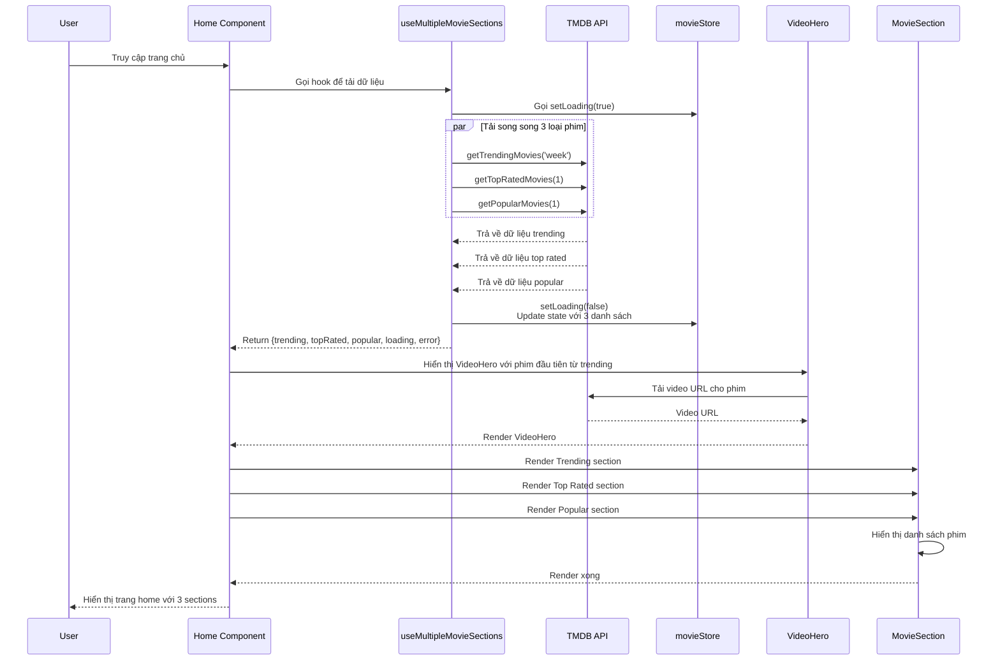
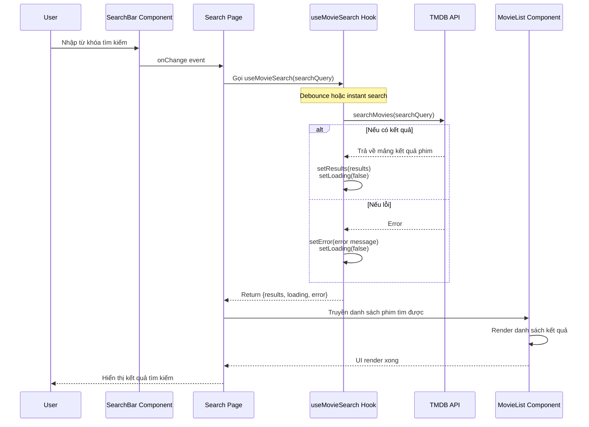
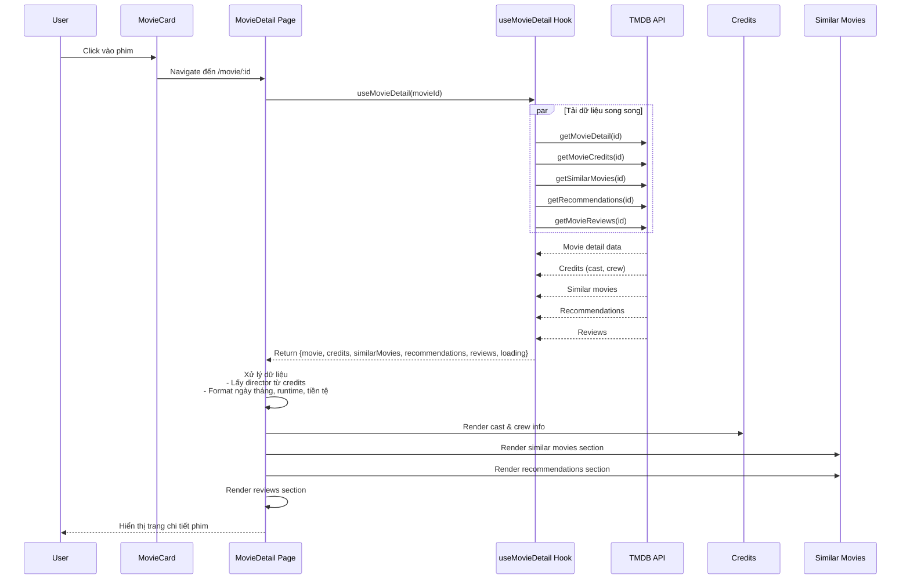
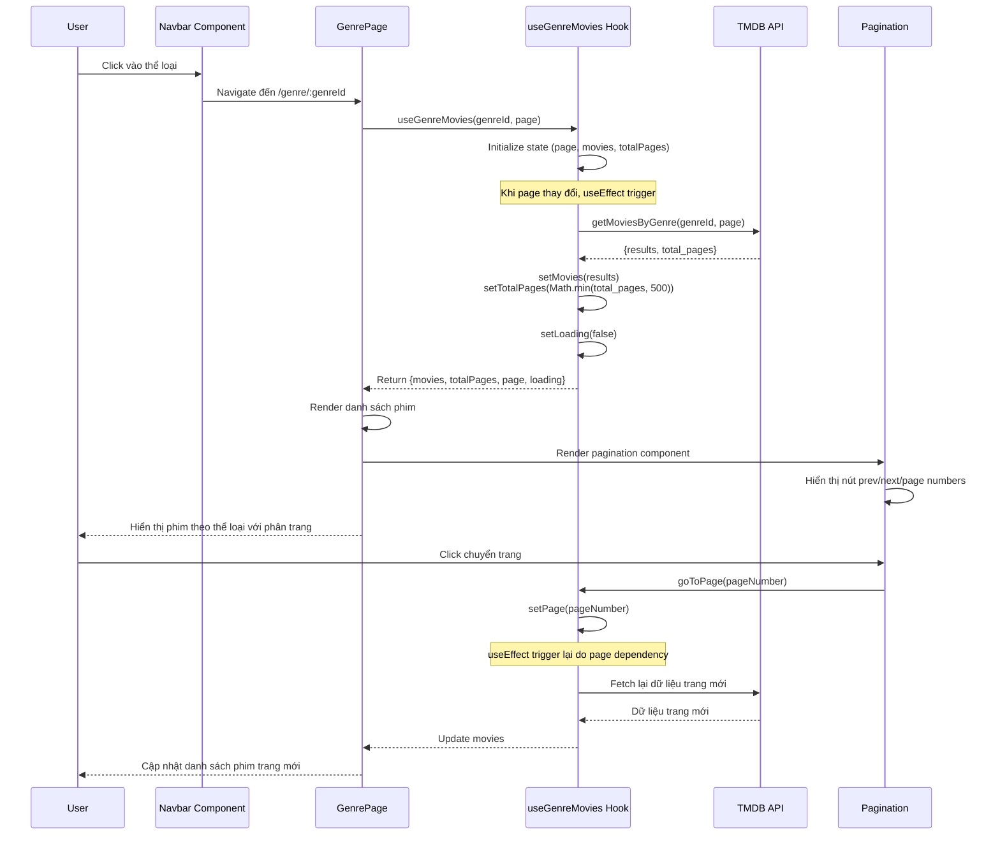
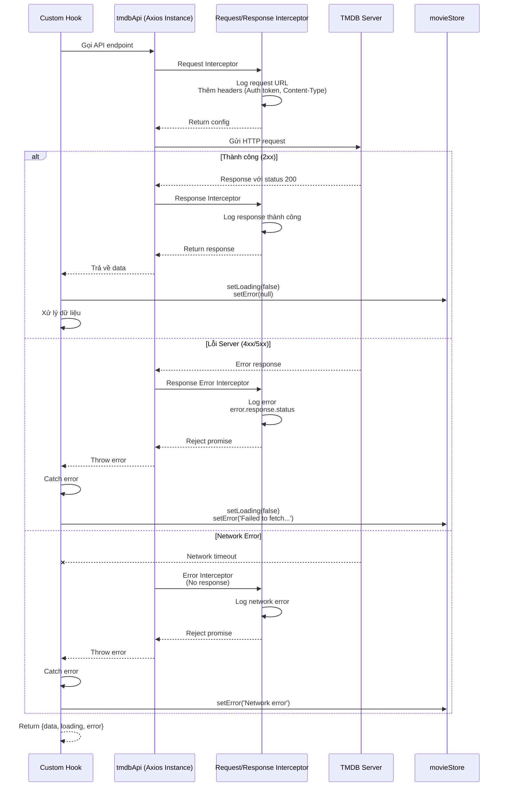
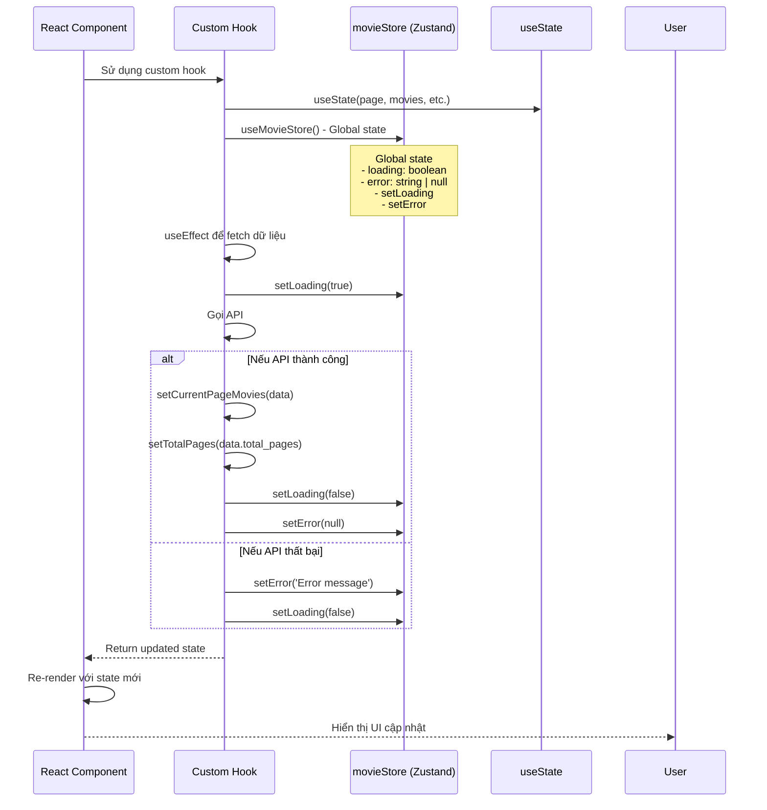
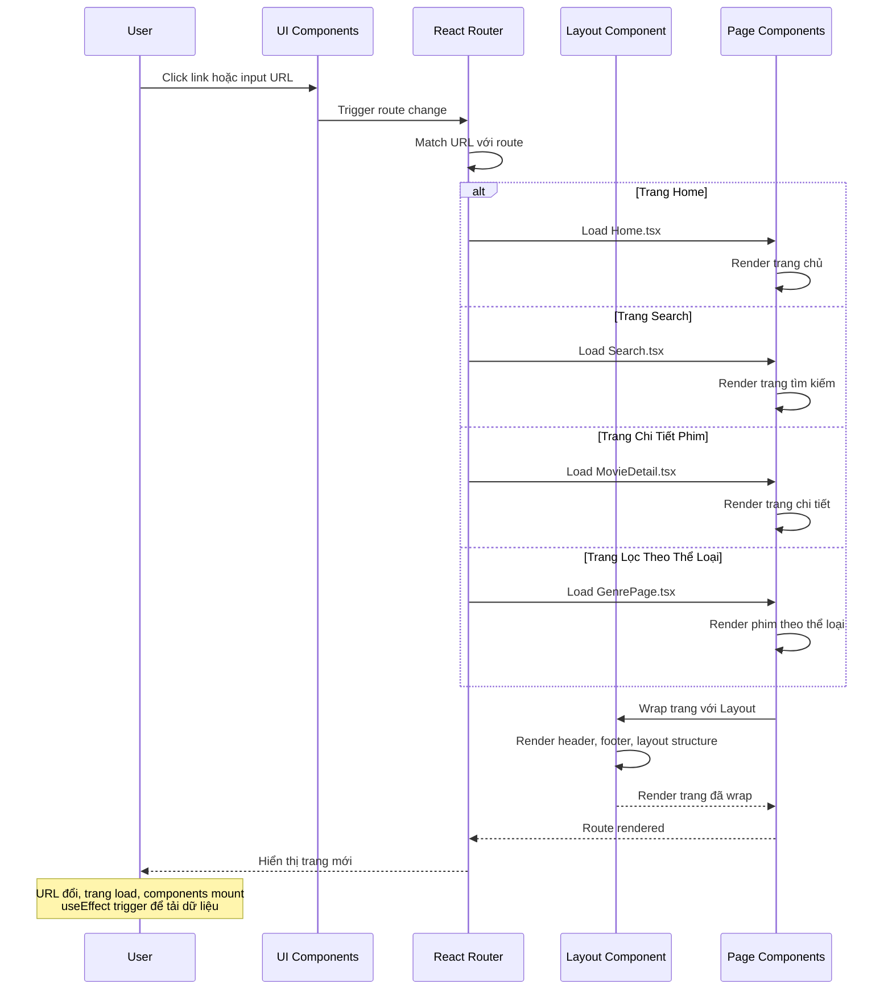

# Sequence Diagrams - Movie Review App

## 1. Luồng Tải Trang Home (Home Page Loading Flow)



## 2. Luồng Tìm Kiếm Phim (Movie Search Flow)



## 3. Luồng Xem Chi Tiết Phim (Movie Detail Page Flow)



## 4. Luồng Lọc Phim Theo Thể Loại (Genre Filter Flow)



## 5. Luồng API Call & Error Handling (API Call Flow)



## 6. Luồng Quản Lý Trạng Thái (State Management Flow)



## 7. Luồng Navigation & Routing (Navigation Flow)



## Tóm tắt Cấu trúc Ứng dụng

```
┌─────────────────────────────────────────────────────┐
│                   User Interface                    │
│  (Navbar, MovieCard, SearchBar, Pagination, etc.)   │
└──────────────────┬──────────────────────────────────┘
                   │
        ┌──────────┴──────────┐
        │                     │
    ┌───▼───┐            ┌───▼────┐
    │ Pages │            │Hooks   │ (Data Fetching & Logic)
    │       │            │        │
    │ Home  │            │useMovies
    │Search │            │useMovieDetail
    │Detail │            │useGenreMovies
    │Genre  │            │useMultipleMovieSections
    └───┬───┘            └───┬────┘
        │                    │
        └────────┬───────────┘
                 │
            ┌────▼─────┐
            │   API    │
            │ Endpoints│
            │          │
            │endpoints.│
            │tmdb.ts   │
            └────┬─────┘
                 │
          ┌──────▼──────┐
          │  TMDB API   │
          │  (axios)    │
          └─────────────┘

    ┌──────────────────────────┐
    │  Global State Store      │
    │  (Zustand)               │
    │  - loading               │
    │  - error                 │
    │  - setLoading()          │
    │  - setError()            │
    └──────────────────────────┘
```

---

## Ghi chú quan trọng:

1. **Parallel API Calls**: Ứng dụng sử dụng `Promise.all()` để tải nhiều dữ liệu song song, giảm thời gian loading.

2. **Global State Management**: `movieStore` (Zustand) quản lý trạng thái loading và error toàn cục.

3. **Error Handling**: Mỗi hook đều có try-catch để xử lý lỗi từ API.

4. **Request Interceptor**: Tự động thêm authorization token vào mỗi request.

5. **Response Interceptor**: Xử lý lỗi API và network errors.

6. **Debounce Search**: Có thể implement debounce cho search để giảm số API calls.

7. **Pagination**: Hỗ trợ phân trang với tối đa 500 trang (giới hạn từ TMDB).
